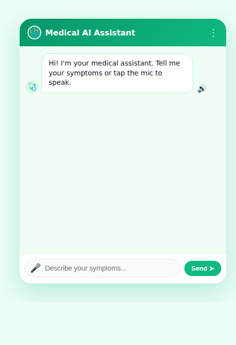
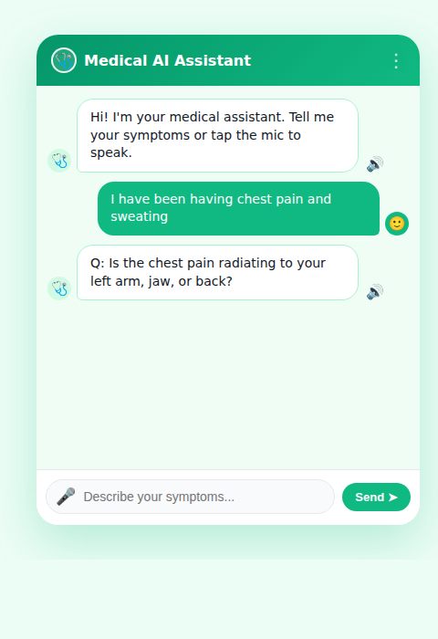
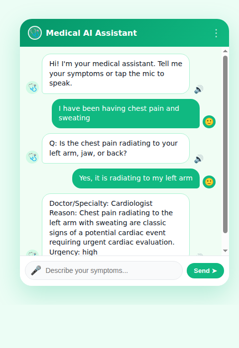
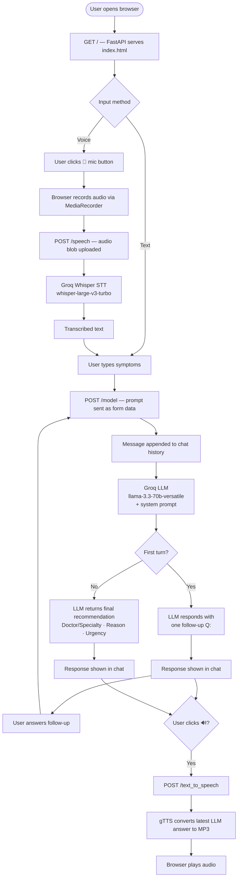

# 🩺 Medical Routing Assistant

A conversational AI-powered medical triage and patient-routing assistant. Describe your symptoms via text or voice, and the assistant asks one targeted follow-up question before recommending the right doctor or specialist.

## Features

- **Symptom-to-specialist routing** — routes patients to the right doctor based on described symptoms
- **Conversational triage** — asks exactly one clarifying follow-up question before giving a recommendation
- **Voice input** — record your symptoms using your microphone; transcribed via Whisper (Groq)
- **Text-to-speech playback** — listen to the assistant's response via the 🔊 button
- **Clean chat UI** — responsive web interface served directly by FastAPI

## Tech Stack

| Layer | Technology |
|---|---|
| Backend | [FastAPI](https://fastapi.tiangolo.com/) |
| LLM | [Groq](https://groq.com/) — `llama-3.3-70b-versatile` |
| Speech-to-text | Groq Whisper (`whisper-large-v3-turbo`) |
| Text-to-speech | [gTTS](https://gtts.readthedocs.io/) |
| Frontend | Vanilla HTML/CSS/JS (`index.html`) |

## Prerequisites

- Python 3.9+
- A [Groq API key](https://console.groq.com/)

## Installation

1. **Clone the repository**

   ```bash
   git clone https://github.com/AshwinMadhav10/Medical-Routing-Assistant.git
   cd Medical-Routing-Assistant
   ```

2. **Install dependencies**

   ```bash
   pip install -r requirements.txt
   ```

3. **Set up your environment**

   Create a `.env` file in the project root:

   ```env
   APIKEY=your_groq_api_key_here
   ```

## Running the App

```bash
uvicorn medical:app --reload
```

Then open your browser at [http://localhost:8000](http://localhost:8000).

## Usage

1. **Text input** — type your symptoms in the input box and press **Send** or hit **Enter**.
2. **Voice input** — click the 🎤 microphone button to start recording, click again to stop. Your speech is transcribed and sent automatically.
3. The assistant will ask **one follow-up question**, then provide a recommendation in the format:

   ```
   Doctor/Specialty: <doctor type>
   Reason: <short clinical routing reason>
   Urgency: normal | moderate | high
   ```

4. Click the **🔊** button on any assistant message to hear the response read aloud.

## API Endpoints

| Method | Endpoint | Description |
|---|---|---|
| `GET` | `/` | Serves the chat UI |
| `POST` | `/model` | Sends a text prompt; returns the LLM response |
| `POST` | `/speech` | Accepts an audio file; returns transcription and LLM response |
| `POST` | `/text_to_speech` | Returns an MP3 of the latest LLM response |

## Screenshots

> **Chat interface** — type or speak your symptoms, receive a specialist recommendation.

| Initial Screen | Follow-up Question | Final Recommendation |
|---|---|---|
|  |  |  |

---

## App Flowchart



---

## Routing Logic

| Symptom | Recommended Specialist | Urgency |
|---|---|---|
| Chest pain, radiating pain, sweating, dizziness, breathing difficulty | Cardiologist | High |
| Fever, cough, cold | General Physician | Normal |
| Breathing problems | Pulmonologist | Normal/Moderate |
| Stomach issues | Gastroenterologist | Normal |
| Headache, dizziness | Neurologist / General Physician | Normal/Moderate |
| Minor or vague symptoms | General Physician | Normal |

> **Disclaimer:** This assistant is for routing/triage purposes only. It does not diagnose conditions or recommend medications. Always consult a qualified medical professional.
